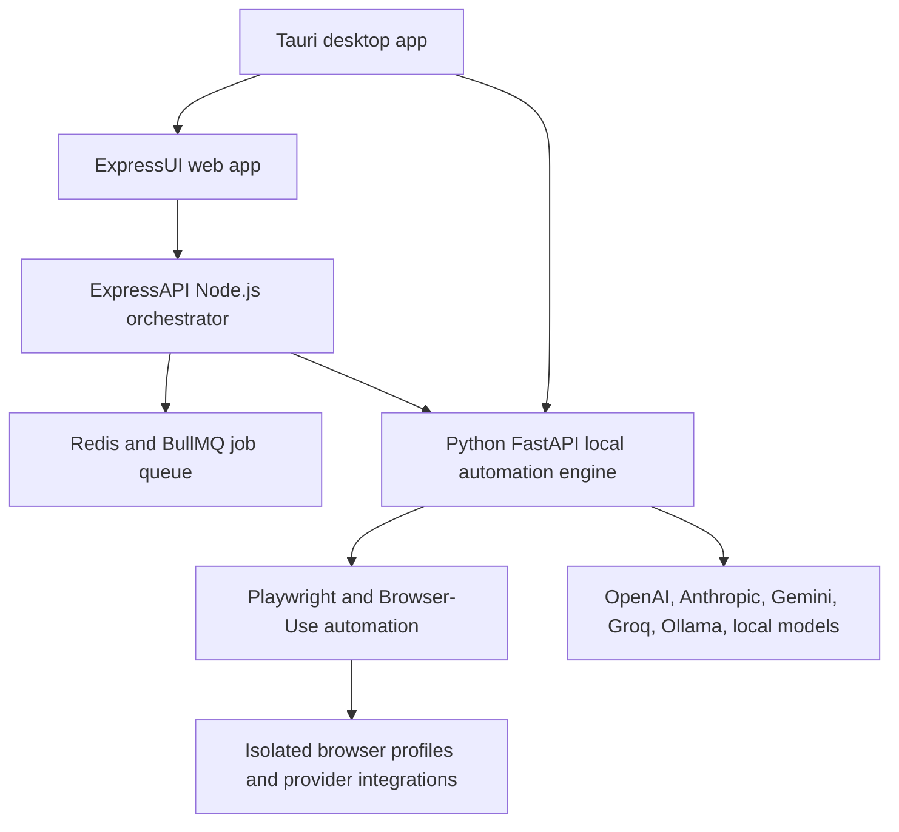

# Elyt

AI browser automation across profiles.

[Website](https://elyt-ai.com/) | [Demo video](media/elyt-demo.mp4) | [Product overview](docs/PRODUCT_OVERVIEW.md) | [Showcase TODO](docs/SHOWCASE_TODO.md)

Elyt is a private commercial platform for building AI-powered browser workflows, running them across many isolated browser profiles, and monitoring execution from one place. This repository is the public showcase for the product. It contains marketing material, screenshots, video assets, and public-safe documentation only.

The production source code lives in a private repository and is not included here.

## Demo

  

## What Elyt Does

- Turns plain-English instructions into reusable browser automation workflows.
- Runs workflows across many isolated browser profiles instead of one local browser session.
- Connects with browser profile providers such as AdsPower, MoreLogin, GoLogin, and custom CDP-based setups.
- Supports multi-step workflows with branching, scheduling, retries, execution history, and status tracking.
- Works with multiple AI model providers, including OpenAI, Anthropic, Google Gemini, Groq, Ollama, and local models.
- Provides both web and desktop deployment paths for teams that need cloud convenience or local execution.

## Screenshots

| Workflow builder | Profile orchestration | Execution monitoring |
| --- | --- | --- |
|  |  |  |

[View the full-page marketing screenshot](media/elyt-full-page.png).

## Product Highlights

### Profile orchestration

Create and organize browser profiles, assign workflows to profile groups, and launch runs in parallel or staggered batches.

### Visual workflow system

Build multi-node automations from natural-language tasks. Chain actions, pass data between steps, schedule recurring runs, and monitor every execution.

### AI execution engine

Elyt combines a Node.js orchestration API, a FastAPI automation engine, Playwright/browser automation, model-provider integrations, and a Tauri desktop shell for local workflows.

### Monitoring and history

Track workflow status, profile-level execution, logs, screenshots, generated files, and run history for debugging and operational review.

## Architecture At A Glance

## Public Repo Scope

Included:

- Public README and product explanation.
- Screenshots, posters, and demo video assets.
- High-level architecture and use-case documentation.
- Responsible-use positioning and launch TODOs.

Not included:

- Private application source code.
- API keys, form keys, customer data, logs, databases, cookies, or environment files.
- Operational bypass techniques, internal provider implementation, or private deployment scripts.

## Use Cases

- Data collection from authorized sources.
- E-commerce monitoring and product research.
- QA and repeatable browser workflow testing.
- Internal operations that require repeatable browser tasks.
- Managed multi-account workflows where the operator owns or is authorized to control the accounts.

## Links

- Website: [elyt-ai.com](https://elyt-ai.com/)
- Founder: [ArshiaHemati.com](https://arshiahemati.com/)
- GitHub organization: [AHGesports](https://github.com/AHGesports)

## Status

Elyt is live as a private commercial product. Access is handled through demos and direct customer onboarding.
