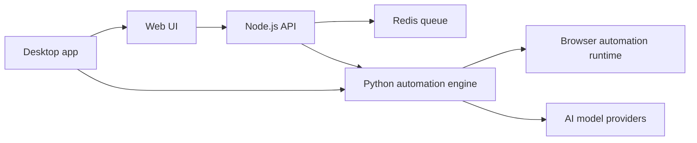

# Product Overview

Elyt is a private AI browser automation platform for teams and operators that need repeatable browser workflows at scale.

It was formerly codenamed AutoFlow / 2js internally. Public-facing material should use only the Elyt name unless historical context is necessary.

## Positioning

Elyt helps users describe browser tasks in plain English, convert those tasks into reusable workflows, assign workflows to many isolated profiles, schedule runs, and inspect execution history.

The public message should emphasize:

- AI workflow creation.
- Profile orchestration.
- Scheduling and monitoring.
- Provider compatibility.
- Web and desktop deployment options.
- Responsible automation for owned or authorized workflows.

## Public-Safe Architecture

## Components

### Web interface

The UI provides profile management, workflow design, scheduling, execution monitoring, and history views.

### Node.js orchestration API

The API handles authentication, workflow management, profile management, scheduling, execution state, file uploads, and service coordination.

### Python automation engine

The local automation engine executes browser workflows, coordinates AI model calls, interacts with browser automation frameworks, stores artifacts, and reports status back to the orchestrator.

### Desktop shell

The Tauri desktop app supports local execution for users that prefer running workflows from their own machine.

### AI integrations

The product supports multiple provider families, including OpenAI, Anthropic, Google Gemini, Groq, Ollama, and local models.

## Capabilities

- Profile and profile-group management.
- Natural-language action creation.
- Visual multi-node workflow builder.
- Parallel and scheduled execution.
- Execution logs, screenshots, files, and history.
- Multi-provider AI model selection.
- Web and desktop deployment.
- Provider-compatible browser profile orchestration.
