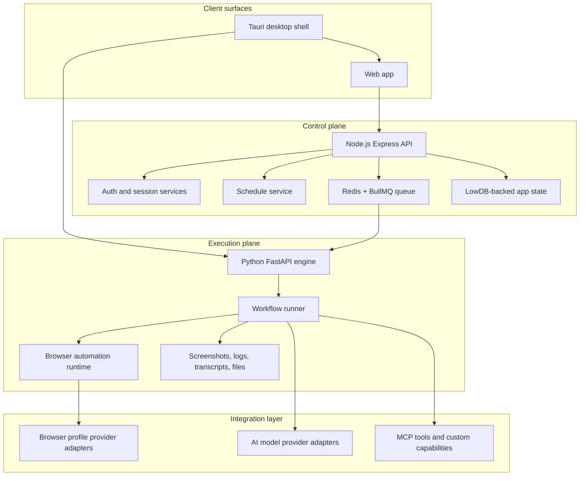
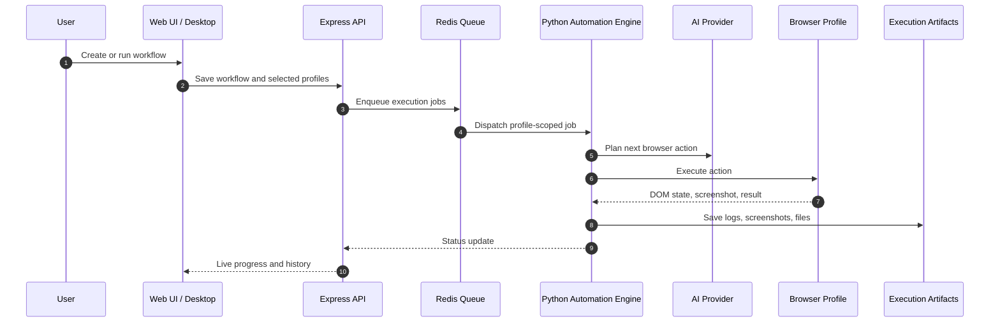
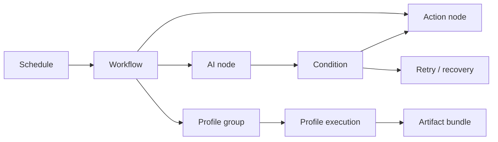
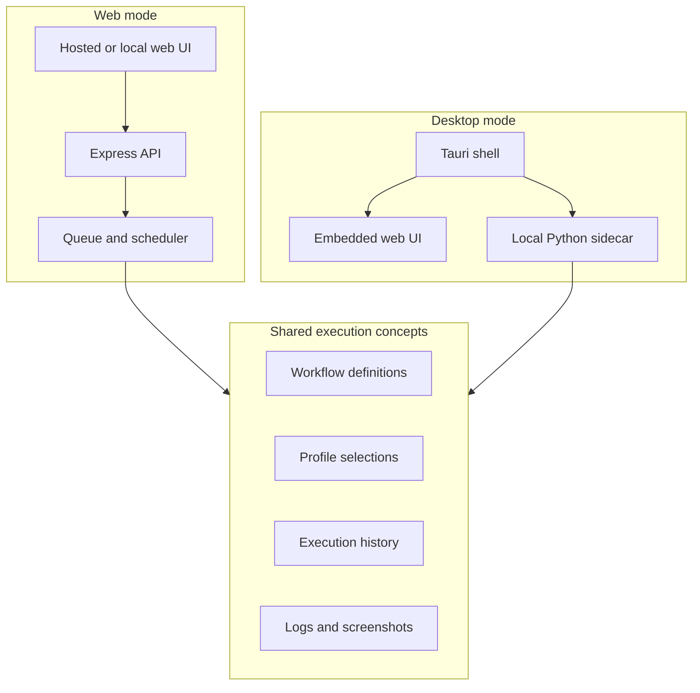

# Technical Architecture

This page summarizes the public-safe engineering architecture behind Elyt. It is intentionally high level: the production implementation remains private, but the system design is useful for technical evaluators.

## System Topology

## Execution Flow

## Workflow Model

## Deployment Modes

## Interesting Technical Details

### Split control plane and execution plane

The Node.js API owns product state, user-facing workflows, scheduling, and orchestration. The Python engine owns browser execution, AI action planning, runtime observation, and generated artifacts. That split keeps the product API stable while allowing the automation engine to evolve independently.

### Profile-scoped execution

Workflow runs are broken into profile-scoped jobs. This lets Elyt track status per profile, retry individual failures, stagger workloads, and preserve execution artifacts without collapsing everything into one global run state.

### Queue-backed scheduling

Recurring runs and batch launches go through a queue boundary. This keeps the UI responsive, gives the system a place to persist job state, and makes it easier to resume or inspect long-running work.

### Provider adapter boundaries

AI models and browser profile providers sit behind adapter boundaries. The product can route work to different model families or profile providers without rewriting workflow definitions.

### Artifact-first debugging

Executions produce structured artifacts: logs, screenshots, transcripts, generated files, and final status. That makes workflow debugging practical because operators can inspect what happened at each node and profile.

### Desktop as a local execution shell

The desktop app is not a separate product surface bolted on later. It wraps the same web workflow concepts while adding a local Python sidecar for users who need local execution.

### Contract-driven APIs

The private implementation uses schema validation and API contracts around important request/response boundaries. That matters because workflow definitions, execution state, and provider configuration are passed between multiple runtimes.

## Technology Map

| Layer | Main technologies |
| --- | --- |
| Web UI | Vanilla JavaScript, modular frontend services, CSS/SCSS |
| Product API | Node.js, Express, JWT/session services, AJV validation |
| Queueing | Redis, BullMQ |
| Automation engine | Python, FastAPI, Pydantic, async services |
| Browser runtime | Playwright, browser automation framework integrations |
| Desktop | Tauri, Rust shell, embedded local services |
| AI providers | OpenAI, Anthropic, Google Gemini, Groq, Ollama, local models |
| Artifacts | Screenshots, logs, transcripts, generated files |

## Private By Design

The public repository does not include source code, provider internals, deployment scripts, keys, customer data, environment files, logs, or implementation details that should stay private.
